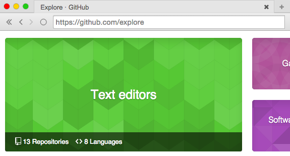

# electron-browser

A browser ui for electron, written in react.

forked from pfraze/electron-browser for use in electric-gb



**Install instructions**

To run this code, follow these steps:

```
git clone https://github.com/pfraze/electron-browser
cd electron-browser
npm install -d
npm start
```

## License

MIT
